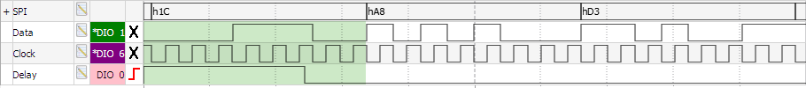
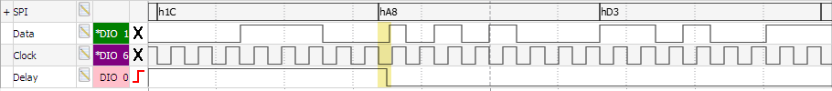
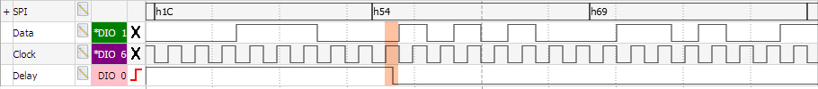
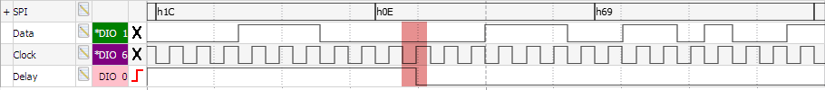
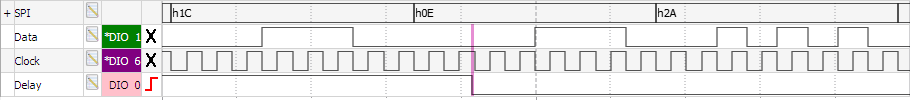
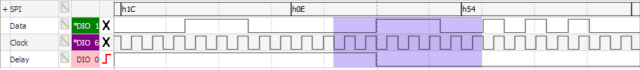
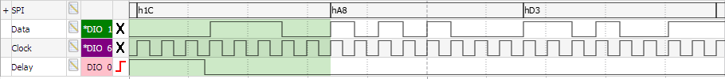
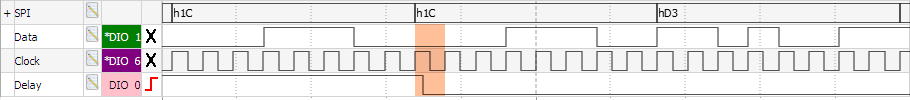
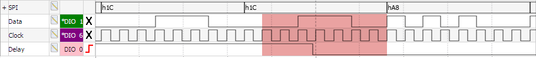

# USCI40_demo

## Overview

This is a simplified version of the firmware I wrote to characterise the MSP430G2553 USCI40 erratum. The original version was used to generate the series of logic analyser captures shown as animations in the following forum post:

https://e2e.ti.com/support/microcontrollers/msp430/f/166/t/363755

## Erratum Description

When clocked externally, the USCI peripheral doesn't have the option to delay transmission until it's ready. It needs to output the next bit when the leading edge of the next clock pulse arrives, even if its shift register is empty and TXBUF hasn't been updated.

Ideally the USCI would have one consistent behaviour in cases where TXBUF was loaded too late. For example, it could always retransmit the previous byte loaded into TXBUF. That might break any higher-level protocol being used, but would produce valid signal timings and keep the USCI in sync with the clock source.

Unfortunately the USCI shows multiple behaviours in this case, depending on how late TXBUF was loaded.

## Sample output

In the logic analyser captures shown below, TXBUF gets set to `0xA8` immediately after the falling edge on the delay output (bottom row). The highlighted region of each capture shows the range of delays that would give the same result.

### UCCKPH set

The issue is particularly severe when the `UCCKPH` bit is set, which results in five different error behaviours.

#### Correct output

If TXBUF is loaded early enough there is no problem. The new value is transferred into the internal transmit shift register of the USCI, and is used as the next byte to output. 

#### Error 1: Leading bit glitch

If TXBUF is loaded up to 0.5 SPI clock cycles late, then the data pin changes state when TXBUF is loaded. In the worst case it can change immediately before the trailing edge of the SPI clock (when the data line is supposed to be stable). This could result in the wrong value being received at the other end (eg `0x28` instead of `0xA8`).

#### Error 2: Repeated last bit

If TXBUF is loaded from 0.5 up to 1 SPI clock cycles late, then the USCI becomes offset by one bit from the external clock. This transmit offset persists until the USCI is reset. It repeats the previous bit for one extra clock, then transfers TXBUF into the shift register and uses that value for the next eight bits.

#### Error 3: Repeated last bit, next byte replaced by previous

If TXBUF is loaded from 1 up to 2 SPI clock cycles late, then the USCI becomes offset by one bit from the external clock. This transmit offset persists until the USCI is reset. It repeats the previous bit for one extra clock, then the current shift register value gets reused for the subsequent eight bits. The TXIFG bit is set again, so the value in TXBUF is overwritten without ever being sent. 

#### Error 4: Repeated last bit and byte, another repeated bit

If TXBUF is loaded exactly 2 SPI clock cycles late, then the USCI becomes offset by two bits from the external clock. This transmit offset persists until the USCI is reset. It repeats the previous bit for one extra clock, then the current shift register value gets reused for the subsequent eight bits. The previous bit is repeated and then the value in TXIFG is copied to the shift register and output for the following eight bits.

#### Error 5: Repeated last bit and byte

If TXBUF is loaded more than 2 SPI clock cycles late, then the USCI becomes offset by one bit from the external clock. This transmit offset persists until the USCI is reset. It repeats the previous bit for one extra clock, then the current shift register value gets reused for the subsequent eight bits. The value in TXIFG is copied to the shift register and output for the following eight bits.

### UCCKPH clear

The issue is less severe when the `UCCKPH` bit isn't set, but there are still two different error behaviours when TXBUF is loaded late.

#### Correct output

If TXBUF is loaded early enough there is no problem. The new value is transferred into the internal transmit shift register of the USCI, and is used as the next byte to output. 

#### Error 1: Next byte replaced by previous

If TXBUF is loaded up to 1 SPI clock cycle late, then the current shift register value gets reused for the subsequent eight bits. The TXIFG bit is set again, so the value in TXBUF is overwritten without ever being sent. 

#### Error 2: Repeated last byte

If TXBUF is loaded more than 1 SPI clock cycle late, then the current shift register value gets reused for the subsequent eight bits. The value in TXIFG is copied to the shift register and output for the following eight bits.
